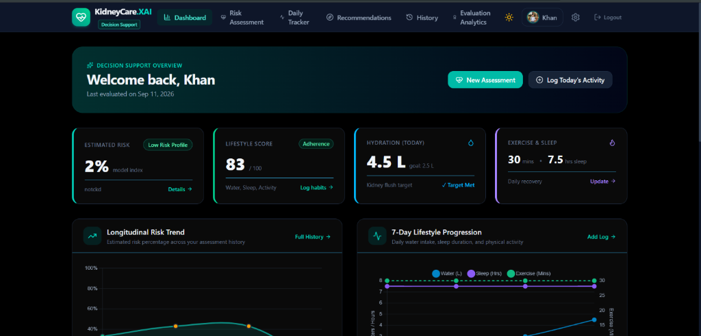
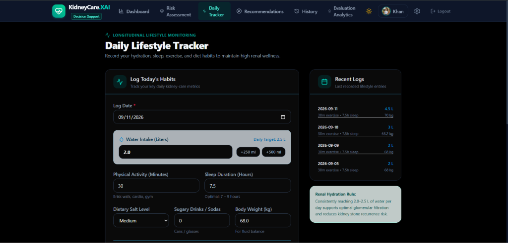
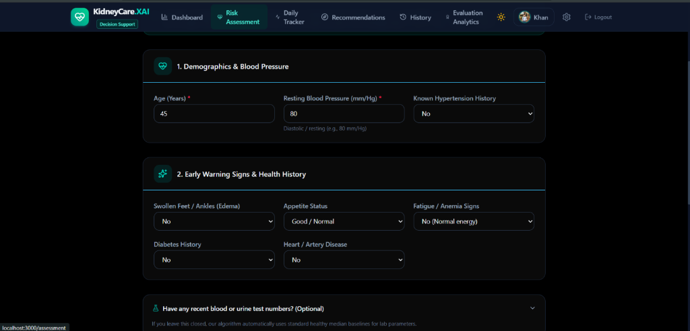
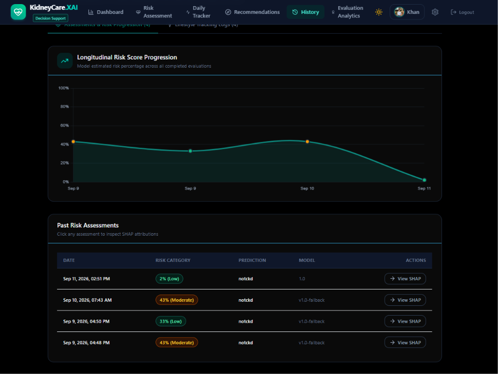
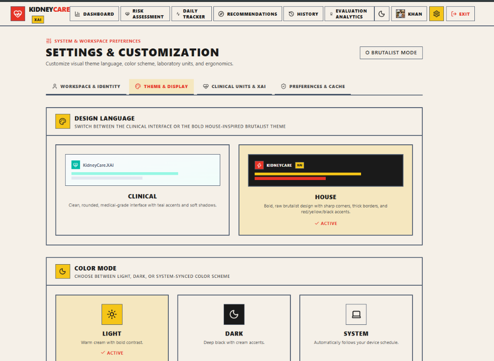

# KidneyCare-XAI

**An Explainable Machine Learning-Based Decision Support Framework for Personalized Kidney Disease Risk Assessment and Lifestyle Monitoring**

---

## Overview

KidneyCare-XAI is a full-stack web-based intelligent decision-support system for kidney-health risk awareness. It combines:

- **Machine Learning** — estimates kidney disease risk from clinically relevant data
- **Explainable AI (SHAP)** — explains which input features contributed to the model's prediction
- **Lifestyle Monitoring** — allows users to record water intake, exercise, sleep, diet-related habits, weight, etc.
- **Rule-Based Recommendation Engine** — generates transparent, personalized health-awareness recommendations
- **Longitudinal Tracking** — stores assessments and lifestyle entries so users can see trends over time

> **This application provides educational risk assessment and lifestyle decision support. It does not diagnose kidney disease and should not replace professional medical advice.**

---

## 📸 Application Screenshots

### 1. Decision Support Risk Dashboard

*Overview of patient's estimated risk index, lifestyle adherence score (83/100), daily hydration target status (4.5 L), exercise/sleep metrics, and longitudinal risk trend chart.*

---

### 2. Longitudinal Lifestyle Tracker

*Daily recording interface for water intake (L), physical activity (mins), sleep duration (hrs), dietary salt level, sugary drink consumption, and body weight (kg) with KDIGO hydration guidance.*

---

### 3. Clinical Risk Assessment Form

*Interactive 24-feature clinical assessment intake capturing patient demographics, resting blood pressure, early warning signs (edema, fatigue, appetite status), and lab biomarkers.*

---

### 4. Risk History & SHAP Attributions

*Longitudinal risk score progression curve over time alongside historical assessment entries with interactive SHAP explanation inspect links.*

---

### 5. Multi-Theme Customization & Ergonomics

*Customizable visual design language allowing users to toggle between standard Clinical UI and the bold House Brutalist theme with Light, Dark, or System color modes.*

---


## Architecture

```
React Frontend → Spring Boot REST API → PostgreSQL/Supabase
                                      → Python ML Service (FastAPI)
                                        → ML Model + SHAP Explainer
```

**Core Principle:** ML predicts → SHAP explains → Rules recommend → Tracking monitors

---

## Technology Stack

| Technology | Purpose |
|---|---|
| Java + Spring Boot | Main backend / REST APIs |
| Spring Data JPA + Hibernate | Database ORM |
| Spring Security + JWT | Authentication & authorization |
| PostgreSQL / Supabase | Persistent storage |
| React.js + Tailwind CSS | Frontend UI |
| Axios | HTTP client (React → Spring Boot) |
| Chart.js | Dashboard visualizations |
| Python + FastAPI | ML inference service |
| Scikit-learn / XGBoost | ML model training |
| SHAP | Model explainability |
| Docker | Containerization |

---

## Project Structure

```
kidneycare-xai/
├── frontend/              # React + Tailwind CSS
├── backend-springboot/    # Java Spring Boot API
├── ml-service/            # Python FastAPI ML service
├── research/              # Literature, questionnaires, analysis
├── docs/                  # Architecture, DB schema, API docs, execution logs
│   ├── SYSTEM_EXECUTION_LOG.md # Complete step-by-step file & flow documentation
│   ├── api/api-spec.md         # REST API contracts
│   └── database/schema.sql     # PostgreSQL database schema
├── docker-compose.yml     # Multi-service deployment
└── README.md
```

---

## Setup Instructions

### Prerequisites
- Java 17+
- Node.js 18+
- Python 3.10+
- PostgreSQL 15+ (or Supabase account)
- Maven 3.9+

### Quick Start

```bash
# 1. Clone the repository
git clone <repo-url>
cd kidneycare-xai

# 2. Start the database
docker-compose up db -d

# 3. Start the ML service
cd ml-service
pip install -r requirements.txt
uvicorn app.main:app --host 0.0.0.0 --port 8000

# 4. Start the Spring Boot backend
cd backend-springboot
mvn spring-boot:run

# 5. Start the React frontend
cd frontend
npm install
npm run dev
```

---

## Limitations

- Dataset size and representativeness
- Self-reported college data
- Absence of clinical validation
- Model probability/calibration limitations
- Recommendation rules are decision-support guidance, not clinical prescriptions

---

## License

This project is developed for academic research purposes.
